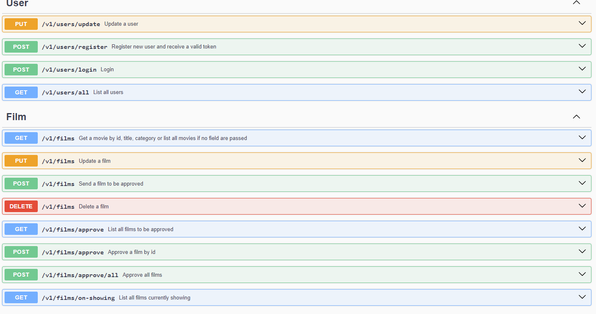

# Cinema Manager

## Descrição do Projeto

Este é um projeto para criar um sistema de gerenciamento de filmes para um cinema. O sistema permite o cadastro, listagem, ordenação, paginação e remoção automática de filmes, além de contar com autenticação e autorização para diferentes usuários.

## Tecnologias Utilizadas

- Spring Framework
- Spring Security
- Java 21
- Maven
- MySQL
- Swagger
- docker

## Endpoints

Todos os endpoints estão documentados no Swagger, que pode ser acessado em [localhost:8080/swagger-ui.html](localhost:8080/swagger-ui.html).

Certifique-se de que o MySQL esteja configurado corretamente e as credenciais do banco de dados estejam definidas no arquivo `application.properties`.

Após a execução, a aplicação estará disponível e pronta para uso.

## Contribuições

Contribuições são bem-vindas! Sinta-se à vontade para abrir uma issue ou enviar um pull request para melhorar este projeto.

---

# Cinema Manager

## Project Description

This is a project to create a movie management system for a cinema. The system allows for movie registration, listing, sorting, pagination, and automatic removal, as well as authentication and authorization for different users.

## Technologies Used

- Spring Framework
- Spring Security
- Java 21
- Maven
- MySQL
- Swagger
- Docker

## Endpoints

All endpoints are documented in Swagger, which can be accessed at [localhost:8080/swagger-ui.html](localhost:8080/swagger-ui.html).

Make sure MySQL is configured correctly and the database credentials are set in the `application.properties` file.

After execution, the application will be available and ready for use.

## Contributions

Contributions are welcome! Feel free to open an issue or send a pull request to improve this project.

---

